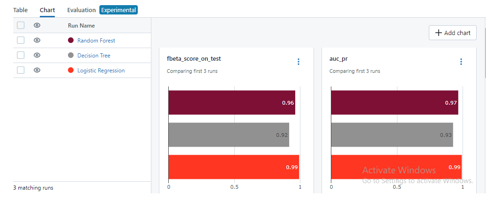

# Data Version Control with DVC

## Initialization

### Initialize Git and DVC:

- `git init`: Initializes a new Git repository.
- `dvc init --subdir`: Initializes a new DVC repository in a subdirectory called ".dvc".

### Commit Initializations:

- `git status`: Checks which files are untracked or modified.
- `git commit -m "DVC initialized"`: Commits the DVC initialization.

## Remote Storage Setup

### Add Remote Storage:

- `dvc remote add -d remote_storage gdrive://1qmHWUWrdxtVzVNPsztMlrmmRHSaVnheb -f`: Adds remote storage using Google Drive.

### Commit Remote Storage Addition:

- `git add .dvc/config`: Adds the DVC configuration changes.
- `git commit -m "Updated remote storage"`: Commits the addition of remote storage.

## Data Preparation and Versioning

### Save Raw Data

- Save pre-processed raw data to a CSV file.
- Split the data into train, test, and validation sets.
- Add these 3 files to DVC.
- Add DVC metadata files of the above 3 to Git.
- Push these files using DVC.

### Versioning

- Repeat the above steps for different seeds.
- Check Git log for commit history.
- Use `git checkout` to checkout specific files from a specific commit.
- Use `dvc checkout` to restore datasets to their state at a specific commit or branch.

### Analyze Data

- Save the files and analyze the distribution of data.
- This approach allows tracking of all updates and changes made to the data.

# Model Version Control and Experiment Tracking with ML Flow

## Overview

The `model_runs` function is designed to train machine learning models using scikit-learn's `GridSearchCV`, log the training process and metrics to MLflow, and save important artifacts such as the best model and evaluation metrics.

## Usage

To use the `model_runs` function, follow these steps:

1. **Define Model Parameters**: Define the model name, parameter grid, and the classifier to be used.

2. **Call the Function**: Call the `model_runs` function with the defined parameters.

3. **Review Results**: After the function execution, review the training and evaluation results printed to the console. Additionally, view the logged artifacts in the MLflow UI.

## Function Parameters

- `model_name`: A string representing the name of the model. This will be used as the name of the MLflow run.
  
- `param_grid`: A dictionary containing the hyperparameters to be tuned using GridSearchCV.

- `model_classifier`: The scikit-learn classifier object to be trained.

## MLflow Integration

The `model_runs` function integrates with MLflow for experiment tracking and artifact logging. The following information is logged to MLflow:

- **Parameters**: The best hyperparameters found by GridSearchCV are logged.
  
- **Metrics**: Various evaluation metrics such as f-beta score, AUC of the Precision-Recall curve, recall, and precision are logged.

- **Artifacts**: The best model and visualizations of the confusion matrix and Precision-Recall curve are logged as MLflow artifacts.

## Requirements

Ensure that MLflow and scikit-learn are installed in your environment before using the `model_runs` function.

## Example

```python
# Define model parameters
model_name = "Your_Model_Name"
param_grid = {...}  # Define your parameter grid
model_classifier = YourClassifier()  # Instantiate your scikit-learn classifier

# Call the function
model_runs(model_name, param_grid, model_classifier)

# sample screenshots from MLflow


